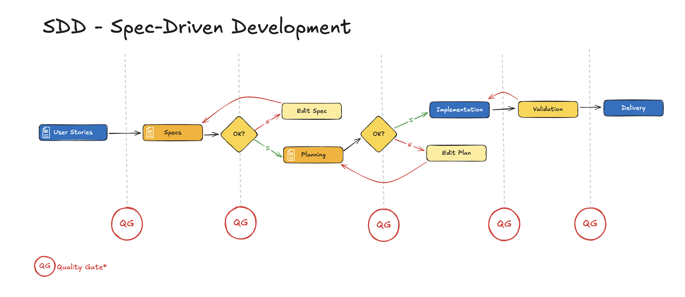

# Spec-Driven Development (SDD) Templates

A comprehensive framework and template collection for **Specification-Driven Development** – a systematic approach where detailed specifications precede implementation to ensure clarity, reduce rework, and improve code quality.

## Quick Overview

SDD follows a four-phase workflow for each feature:

1. **Specification** (1-3 days) - Define WHAT & WHY
2. **Planning** (1-2 days) - Define HOW & WHEN  
3. **Implementation** (Variable) - Write code across 4 layers
4. **Validation** (1-2 days) - Testing, code review, compliance

## What's Included

### Core Documentation
- **`.spec/README.md`** - Complete SDD process guide
- **`.spec/constitution.md`** - Architectural & quality standards
- **`.spec/definition-of-done.md`** - DoD checklist
- **`.spec/reference-architecture.md`** - Patterns & best practices
- **`.spec/nfr-specifications.md`** - Non-functional requirements guide
- **`docs/estimation.md`** - Project time estimation framework

### Templates
- **Feature Specifications** (`.spec/specs/`) - Requirement documentation templates
- **Technical Plans** (`.spec/plans/`) - Implementation design templates
- **Task Breakdowns** (`.spec/tasks/`) - Work item templates
- **Architecture Decision Records** (`.spec/adr/`) - ADR templates
- **Acceptance Tests** (`.spec/acceptance-tests-template.gherkin`) - BDD test templates

### Reference Materials
- **`.spec/traceability.md`** - Requirements-to-code traceability
- **`.spec/risks-and-dependencies.md`** - Risk management guide
- **`.spec/VERSIONING-GUIDE.md`** - Change management
- **`.spec/lessons-learned-template.md`** - Retrospective templates

## Key Benefits

✅ Clear, documented requirements before coding  
✅ Reduced scope creep through rigorous specs  
✅ Improved code quality with architectural standards  
✅ Better knowledge transfer and maintainability  
✅ Faster onboarding for new team members  
✅ Full traceability from requirements to implementation  

## Getting Started

1. **Start a new feature**: Use templates in `.spec/specs/feature-name.md`
2. **Plan technical approach**: Create a plan in `.spec/plans/feature-name.plan.md`
3. **Break down work**: Define tasks in `.spec/tasks/feature-name.tasks.md`
4. **Implement & validate**: Follow architecture patterns in `.spec/reference-architecture.md`
5. **Estimate project scope**: Use the framework in `docs/estimation.md`

## Core Principles

- **Specification First** - Define requirements thoroughly before coding
- **Layered Architecture** - Separate concerns across presentation, application, domain, and infrastructure layers
- **Quality by Design** - Embed quality gates at each phase
- **Traceability** - Maintain clear relationships between specs, plans, tasks, and code
- **Collaboration** - Enable team input and Copilot Chat throughout

## Stack
- Spring Boot 4.0+
- Java 25
- Maven

---

For detailed guidance, refer to [`.spec/README.md`](.spec/README.md).
